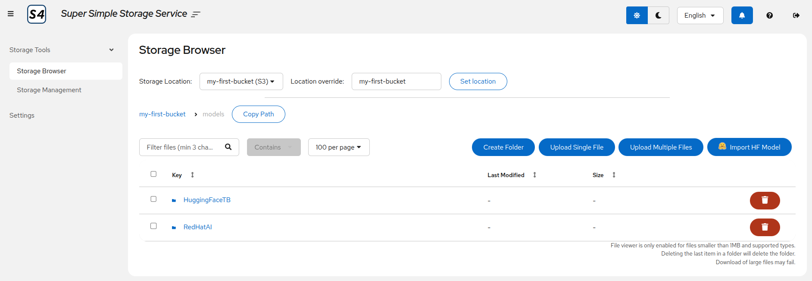

# S4 - Super Simple Storage Service

S4 is a lightweight, self-contained S3-compatible storage solution with a web-based management interface.

Perfect for POCs, development environments, demos, and simple deployments where a full-scale object storage solution is overkill.

It combines Ceph RADOS Gateway (RGW) backed by a standard filesystem and a modern UI into a single, easy-to-deploy container.

S4 provides full S3 API compatibility while requiring minimal resources and configuration.



## Quick Start (local)

```bash
# Run S4 with persistent storage
podman run -d \
  --name s4 \
  -p 5000:5000 \
  -p 7480:7480 \
  -v s4-data:/var/lib/ceph/radosgw \
  quay.io/rh-aiservices-bu/s4:latest

# Access the web UI
open http://localhost:5000

# Use S3 API with default credentials
export AWS_ACCESS_KEY_ID=s4admin
export AWS_SECRET_ACCESS_KEY=s4secret
export AWS_ENDPOINT_URL=http://localhost:7480
aws s3 mb s3://my-bucket
```

## Key Features

- **S3-Compatible API** - Full AWS S3 API compatibility on port 7480
- **Web Management UI** - Modern React interface for storage operations on port 5000
- **Lightweight** - Single container deployment with minimal resources needed
- **Bucket Management** - Create, list, and delete S3 buckets
- **Object Operations** - Upload, download, browse, and delete objects
- **Standard Filesystem Operations** - Browse and manage mounted filesystem/PVC storage
- **Cross-Storage Transfers** - Transfer files between storage locations in any combination (S3 ↔ PVC, S3 ↔ S3, PVC ↔ PVC)
- **HuggingFace Integration** - Direct model import from HuggingFace Hub

## Documentation

- **[Getting Started](docs/getting-started/)** - Installation, configuration, and quick start guides
- **[Architecture](docs/architecture/)** - System design, components, and data flow
- **[API Reference](docs/api/)** - Complete API documentation with examples
- **[Development](docs/development/)** - Contributing, testing, and development guides
- **[Deployment](docs/deployment/)** - Docker, Kubernetes, OpenShift, and production deployment
- **[Security](docs/security/)** - Security policy, authentication, and best practices
- **[Operations](docs/operations/)** - Monitoring, troubleshooting, and FAQ

## License

Apache 2.0
