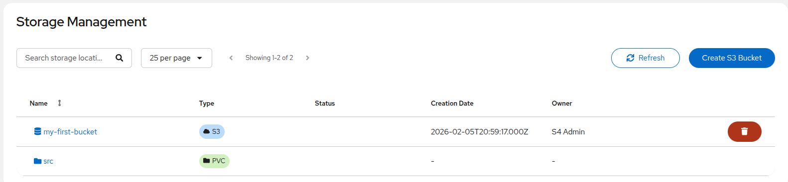
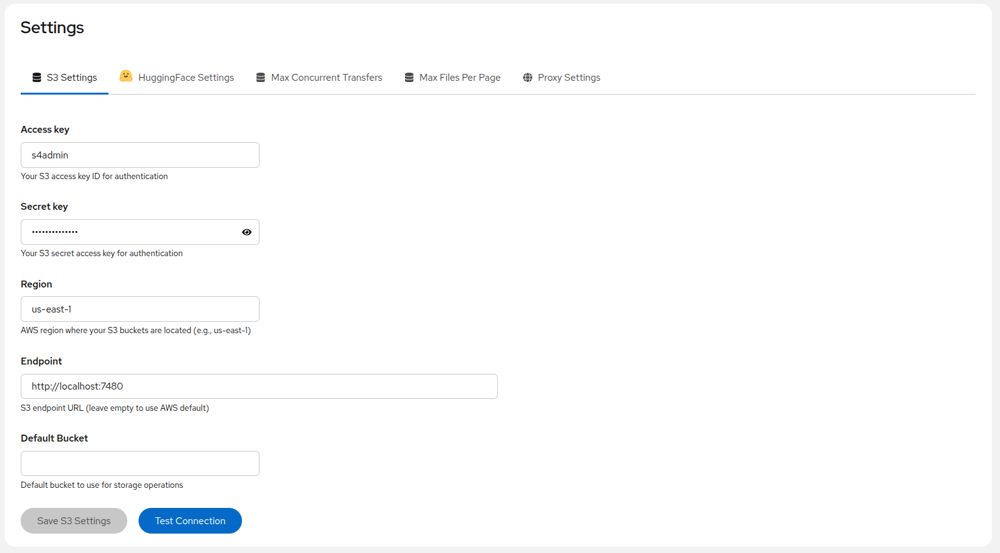
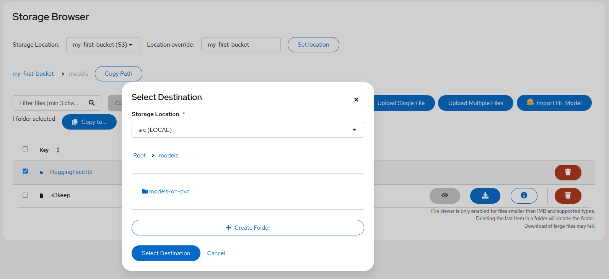
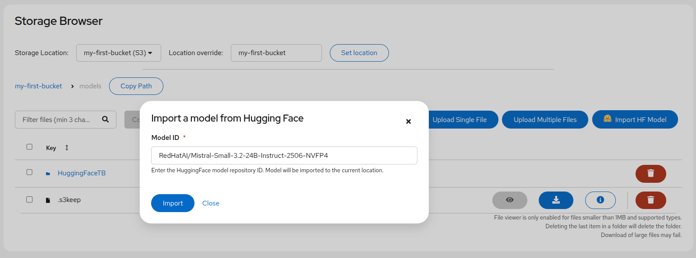

# S4 User Guide

Complete user documentation for S4 (Super Simple Storage Service).

## Overview

S4 is a lightweight, self-contained S3-compatible storage solution providing:

- **Storage Browser** - Navigate, upload, download, and manage files
- **Storage Management** - Create and manage S3 buckets
- **Settings** - Configure S3 connections, HuggingFace integration, and more
- **Transfers** - Copy files between storage locations

---

## Getting Started

### First-Time Access

1. Open your browser and navigate to the S4 URL:

   - **Local development**: `http://localhost:5000`
   - **Production**: Your configured S4 URL

2. If authentication is enabled, you'll see a login screen. Otherwise, you'll go directly to the Storage Browser.

### Login (If Authentication Enabled)

When authentication is enabled, you'll need to log in with your credentials:

1. Enter your **username** and **password**
2. Click **Log in**
3. Your session will remain active for 8 hours (configurable)

> **Note**: If you encounter "Too many login attempts", wait 1 minute before retrying. The system allows a maximum of 5 login attempts per minute.

### UI Overview

The S4 interface consists of:

- **Navigation Sidebar** (left) - Access Storage Browser, Storage Management, and Settings
- **Main Content Area** (center) - View and interact with storage content
- **Header** (top) - Application title and help/logout buttons

---

## Storage Browser

The Storage Browser is the main interface for viewing and managing files across all storage locations.

### Navigating Buckets and Folders

**Location Selector**:

- Use the location dropdown to switch between S3 buckets and local storage locations
- Locations are marked as "Available" or "Unavailable" based on connectivity status

**Breadcrumb Navigation**:

- Click any path segment in the breadcrumb trail to navigate to that folder
- The breadcrumb shows your current location within the storage hierarchy

**Folder Navigation**:

- Click on a folder name to enter it
- Double-click or use the folder icon to open folders

### Uploading Files

S4 supports multiple upload methods:

**Single File Upload**:

1. Click the **Upload** button in the toolbar
2. Select a file from your computer
3. Monitor upload progress in the progress indicator

**Multiple File Upload**:

1. Click the **Upload** button in the toolbar
2. Select multiple files (hold Ctrl/Cmd to select multiple)
3. Monitor progress for each file individually

**Drag and Drop**:

1. Drag files from your file manager
2. Drop them anywhere in the file listing area
3. Uploads begin automatically

> **Note**: Maximum file size is configurable (default: 20GB). Contact your administrator if you need to upload larger files.

### Downloading Files

**Single File Download**:

1. Select a file by clicking on it
2. Click the **Download** button in the toolbar, or
3. Click the download icon in the file's action column

**Multiple File Download**:

1. Select multiple files using checkboxes
2. Click **Download** to download each selected file

### Creating Folders

1. Click the **Create Folder** button in the toolbar
2. Enter a folder name following these rules:
   - Cannot be empty
   - Cannot be `.` or `..`
   - Cannot start with `../`
   - Cannot contain null characters
3. Click **Create** to create the folder

### Deleting Files and Folders

1. Select one or more items using checkboxes
2. Click the **Delete** button in the toolbar
3. Review the confirmation dialog showing items to be deleted
4. Click **Delete** to confirm

> **Warning**: Deleting a folder will delete all its contents. This action cannot be undone.

### Searching for Files

S4 provides powerful search capabilities:

**Search Modes**:

- **Contains** - Find files containing the search term anywhere in the name
- **Starts with** - Find files with names starting with the search term

**Using Search**:

1. Enter your search term in the search box
2. Select the search mode (Contains or Starts with)
3. Click the search icon or press Enter
4. Results are displayed in the file listing

> **Note**: Search is rate-limited to 5 searches per minute to prevent server overload.

### File Details and Preview

**Viewing File Details**:

1. Click the info icon (ℹ️) on any file row
2. View metadata including:
   - File name and path
   - Size
   - Last modified date
   - Content type
   - ETag (for S3 objects)

**File Preview**:

- Supported file types can be previewed directly in the browser
- Click on the file name or the preview icon to open the preview modal
- Supported formats include text files, images, JSON, Markdown, and more

### Object Tagging (S3 Only)

For S3 storage locations, you can add tags to objects:

1. Open the file details modal
2. Navigate to the **Tags** section
3. Add key-value pairs as tags
4. Click **Save** to apply tags

Tags are useful for:

- Organizing objects by project, environment, or category
- Cost allocation and tracking
- Lifecycle policies

---

## Storage Management (Buckets)

The Storage Management page allows you to create and manage S3 buckets.

### Viewing All Storage Locations

The storage management view shows:

- **S3 Buckets** - All accessible S3 buckets
- **Local Storage** - Available local storage locations (PVCs)
- **Status** - Availability status for each location

### Creating S3 Buckets

1. Click **Create Bucket** button
2. Enter a bucket name following AWS S3 naming rules:
   - 3-63 characters long
   - Only lowercase letters, numbers, dots (.), and hyphens (-)
   - Must start and end with a letter or number
   - No consecutive periods
   - Cannot be formatted as an IP address
3. Click **Create** to create the bucket

### Deleting Buckets

1. Locate the bucket you want to delete
2. Click the delete icon or select and click **Delete**
3. Confirm the deletion in the dialog

> **Warning**: You can only delete empty buckets. Remove all objects first.

### Searching and Sorting Locations

**Searching**:

- Use the search box to filter locations by name
- Matches are highlighted as you type

**Sorting**:

- Click column headers to sort by that column
- Click again to reverse sort order
- Available sort columns: Name, Type, Status

---

## Settings

The Settings page allows you to configure S4's connections and behavior.

### S3 Configuration

Configure the S3-compatible storage backend:

| Setting               | Description                                     |
| --------------------- | ----------------------------------------------- |
| **Access Key ID**     | Your S3 access key                              |
| **Secret Access Key** | Your S3 secret key (hidden by default)          |
| **Endpoint**          | S3 endpoint URL (e.g., `http://localhost:7480`) |
| **Region**            | AWS region (e.g., `us-east-1`)                  |

**Saving Configuration**:

1. Enter your S3 credentials
2. Click **Test Connection** to verify connectivity
3. Click **Save** to apply the configuration

> **Note**: Configuration changes take effect immediately but are not persisted across restarts unless set via environment variables.

### Testing S3 Connection

1. After entering credentials, click **Test Connection**
2. S4 will attempt to list buckets using your credentials
3. Success or failure message will be displayed

### HuggingFace Integration

Configure HuggingFace Hub access for model imports:

| Setting               | Description                                  |
| --------------------- | -------------------------------------------- |
| **HuggingFace Token** | API token for accessing private/gated models |

**Getting a Token**:

1. Create an account at [huggingface.co](https://huggingface.co)
2. Go to Settings → Access Tokens
3. Create a new token with "Read" permissions
4. Paste the token in S4's HuggingFace settings

### Max Concurrent Transfers

Controls how many file transfers can run simultaneously:

- **Range**: 1-5 concurrent transfers
- **Default**: 2
- **Recommendation**: Lower values reduce memory usage; higher values improve throughput

### Files Per Page

Controls pagination in the Storage Browser:

- **Range**: 10-500 files per page
- **Default**: 100
- **Recommendation**: Lower values improve load time for slow connections

### Proxy Settings

Configure HTTP/HTTPS proxy for enterprise environments:

| Setting         | Description                     |
| --------------- | ------------------------------- |
| **HTTP Proxy**  | Proxy URL for HTTP connections  |
| **HTTPS Proxy** | Proxy URL for HTTPS connections |
| **Test URL**    | URL to test proxy connectivity  |

**Testing Proxy**:

1. Enter proxy URLs
2. Click **Test Proxy** to verify connectivity
3. The test will attempt to reach the configured test URL through the proxy

---

## Transfers

S4's transfer feature allows copying files between storage locations.

### Starting a Transfer

1. In the Storage Browser, select files or folders to transfer
2. Click the **Copy to...** button in the toolbar
3. The Transfer panel opens showing selected items

### Selecting Destination

1. Choose the destination location from the dropdown
2. Navigate to the destination folder using the breadcrumb or folder list
3. Optionally, create a new folder as the destination

### Conflict Resolution

When files already exist at the destination, choose a resolution strategy:

| Option        | Description                                        |
| ------------- | -------------------------------------------------- |
| **Skip**      | Skip files that already exist (default)            |
| **Overwrite** | Replace existing files with new copies             |
| **Rename**    | Keep both files by adding a suffix to the new file |

### Monitoring Progress

During transfer:

- View real-time progress for each file
- See overall transfer progress percentage
- View transfer speed and estimated time remaining
- Individual file statuses: Pending, Transferring, Completed, Failed, Skipped

### Cancelling Transfers

To cancel an in-progress transfer:

1. Click the **Cancel** button
2. Confirm cancellation in the dialog
3. Files already transferred will remain at the destination

> **Note**: Cancellation may take a moment to complete active file transfers.

### Large Folder Warnings

When transferring folders with many files:

- S4 will display a warning for folders containing 1,000+ items
- Consider transferring in smaller batches for very large transfers
- Monitor system resources during large transfers

---

## HuggingFace Model Import

S4 can import models directly from HuggingFace Hub.

### Importing Models from HuggingFace Hub

1. In the Storage Browser, click **Import from HuggingFace**
2. Enter the model ID (e.g., `HuggingFaceTB/SmolLM2-135M-Instruct`)
3. Select the destination location and folder
4. Click **Import** to start the download

### Using Tokens for Private/Gated Models

Some models require authentication:

**Private Models**:

- Models uploaded to private repositories require an HF token

**Gated Models**:

- Models like Llama 2 require:
  1. Accepting the model's license on HuggingFace
  2. Setting an HF token in S4 Settings

**Setting Up Access**:

1. Accept the model's license on HuggingFace Hub
2. Go to S4 Settings → HuggingFace
3. Enter your HuggingFace token
4. Return to Storage Browser and retry the import

### Selecting Destination

When importing models:

1. Choose a destination S3 bucket or local storage
2. Optionally create or select a subfolder
3. Model files will be downloaded to the specified location

> **Note**: Large models (7B+ parameters) may take significant time to download. Monitor progress in the transfer panel.

---

## Keyboard Shortcuts

| Shortcut           | Action                                    |
| ------------------ | ----------------------------------------- |
| `Enter`            | Open selected folder or file              |
| `Delete`           | Delete selected items (with confirmation) |
| `Escape`           | Close modal dialogs                       |
| `Ctrl+A` / `Cmd+A` | Select all items                          |

---

## Troubleshooting

### Common Issues

**Cannot connect to storage**:

- Verify S3 credentials in Settings
- Check that the S3 endpoint is accessible
- Ensure your network allows connections to the storage backend

**Upload fails**:

- Check file size against the configured limit
- Verify you have write permissions to the destination
- Check browser console for detailed error messages

**Authentication errors**:

- Ensure you're using the correct username and password
- Wait 1 minute if you've exceeded the login rate limit
- Check if your session has expired (8-hour default)

**Transfer fails**:

- Verify source and destination locations are accessible
- Check for sufficient disk space at the destination
- Review conflict resolution settings

For more detailed troubleshooting, see the [Troubleshooting Guide](../operations/troubleshooting.md).

---

## Related Documentation

- [Troubleshooting Guide](../operations/troubleshooting.md) - Common issues and solutions
- [Error Reference](../operations/error-reference.md) - Complete error message reference
- [FAQ](../operations/faq.md) - Frequently asked questions
- [Configuration Guide](../deployment/configuration.md) - Environment variable reference
- [API Reference](../api/README.md) - Backend API documentation
